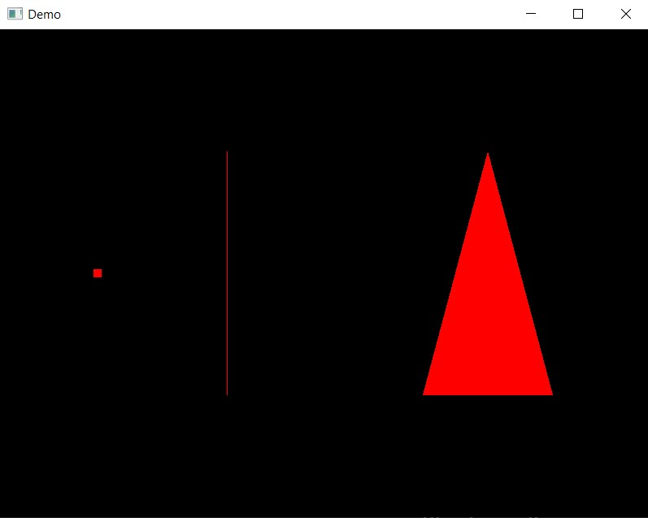

# OpenGL Tutorial using CMake (Any IDE)

## Steps to Get Started: 
### 1. Install GCC Compiler
### 2. Install CMake
### 3. Clone this Repository:
`git clone https://github.com/lighterbird/OpenGL_Tutorial.git`
### 4. For linux also install the following packages using:
```sh
sudo apt-get update
sudo apt-get install pkg-config
sudo apt-get install libx11-dev
sudo apt-get install -y libxcursor-dev
sudo apt install build-essential cmake libx11-dev libxrandr-dev libxinerama-dev libxi-dev libglfw3-dev
sudo apt install libwayland-dev libxkbcommon-dev wayland-protocols extra-cmake-modules
```
### 5. Steps to run 
This project has a `demo` folder and an `exercise` folder.  
Navigate to the respective folder to run, and then use the following commands: 
```sh
mkdir build
cd build
cmake -G "MinGW Makefiles" ..  (windows)    OR   cmake ..        (Mac and linux)
cmake --build .
```
Then run the `OpenGLTutorialExe` executable inside the build folder.

Alternatively, just run the `.bat`(windows) or `.sh` (linux) files in the main folder to automate this process.

The following window should appear if everything is working correctly.


## Exercise:
The `exercise` folder provides a starting point for the exercise.

### Tasks
1. Add a uniform called `cameraMatrix` and set it to scale the world co-ordinates from [(-1, -1), (1,1)] to [(-width/2, -height/2), (+width/2, +height/2)]   
2. Take input `n` from the user and create a `n` sided polygon (define its vertices and indices)  
3. Make the polygon rotate and translate from left to right (reversing direction on going out of bounds)

The output should look something like this  
